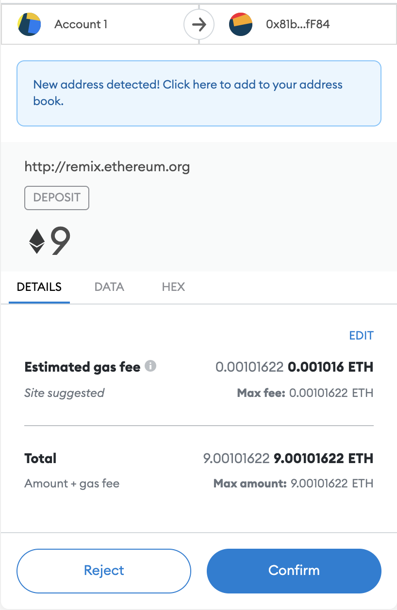

# Solidity Contract Deployment with Remix & Ganache

### Choose 3 accounts to use for employees, and 1 account for HR to fund the others.

First account for HR account:
>>0xa60C5f776d06ae9146dABBE21ba88Ca9B7cC8392

employee 1 account:
>>0xcC50403Ba31df3B0a5Fc554FFD37aa3aC268dB95

employee 2 account:
>>0xE59BCc5bdfD6CF39582BE01A9B54Be2790E69E90

employee 3 account:
>>0x966b8B683deFE722EDe160f9918cef354985c2c8

---

## Connect your metamask to Remix.ethereum:
- using local host HTTP://127.0.0.1:8545
- login to metamask, make sure youre on local and connected to remix
- upload the file AssosiateProfitSplotter.sol to remix
- fill in code for constructor, deposit, and fallback deposit
  
---

## Compile & Deploy

Once you have added addresses payable, deposit, and fallback functions compile the contract and address any compiler errors.
- Make sure to use the correct compiler/ language, then compile.

Go to the deploy tab, add your 3 recipient employees addresses in the `DEPLOY` dropdown then hit the `transact` button. Metamask will ask you to confirm contract deployment.

> 

Confirm contract deployment in metamask. 

> 

---

## Deposit Funds to Employee's Accounts

Choose a value of Ether to deposit to the contract, scroll down and hit `deposit` to deposit the funds. Metamask will appear to confirm. Then check your employee account, and HR account balances in Ganache to make sure the values add up correctly. 

> 

Metamask - confirm the transaction.

> 

Account balances should reflect 1/3 of the total value for each employee account. 

> --> 

---

### Review 

You can view each step on ganache to check the behind the scenes. Click `BLOCK` to see the blocks mined with each step of the contract. 

Click `TRANSACTIONS` to view metadata on your deposit transactions. You can see the amount deposited from HR account to the contract address. The contract then transfers the funds into the employee accounts. 

